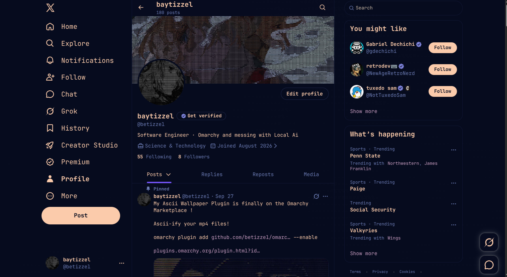

# omarchy-x



Make X (x.com) look like the rest of your [Omarchy](https://omarchy.org) desktop. It uses your active theme's colors and monospace font, and it follows every `omarchy theme set` and `omarchy font set` automatically.

Works in Omarchy's X web app and in normal tabs of any Chromium-based browser (Brave, Chromium, Chrome, Edge).

## Install

```bash
git clone https://github.com/betizzel/omarchy-x ~/Work/omarchy-x
~/Work/omarchy-x/install.sh
```

### Load the extension once

1. Open `brave://extensions` in Brave, or `chrome://extensions` in Chromium and Chrome.
2. Enable **Developer mode**.
3. Click **Load unpacked** and select `~/.local/share/omarchy-x`.

Reload X. The theme switches X to its "Lights out" display mode and recolors it from there.

## How it works

| Piece | Installed to | Role |
|---|---|---|
| `x.css.tpl` | `~/.config/omarchy/themed/` | Omarchy renders it from `colors.toml` on every theme switch |
| `sync.sh` | `~/.local/share/omarchy-x/` | Adds your monospace font, writes the extension's `theme.css` |
| hooks | `~/.config/omarchy/hooks/{theme,font}-set.d/omarchy-x` | Run `sync.sh` after theme/font changes |
| `extension/` | `~/.local/share/omarchy-x/` | Injects `theme.css` into x.com and re-checks it every second while the page is visible |

After a theme switch, X picks up the new colors within about a second. No reload is needed.

To change the look, edit `x.css.tpl` in the repo and re-run `install.sh`. Template tokens such as `{{ accent }}` and `{{ mix accent background 15% }}` are documented in Omarchy's theming docs.

## Update

```bash
git -C ~/Work/omarchy-x pull
~/Work/omarchy-x/install.sh
```

Then click the reload icon on **Omarchy X Theme** in your extensions page and reload X. The browser keeps running the old extension code until you do.

## Uninstall

```bash
~/Work/omarchy-x/uninstall.sh
```

Then remove **Omarchy X Theme** from your browser's extensions page.

## Credits

The X selector map is adapted from [catppuccin/userstyles](https://github.com/catppuccin/userstyles/tree/main/styles/twitter) (MIT).
